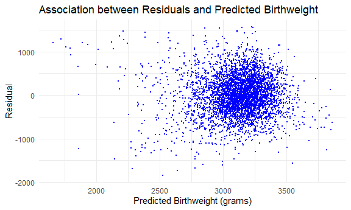
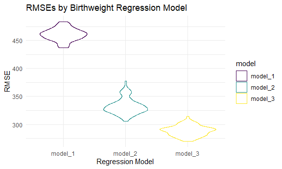
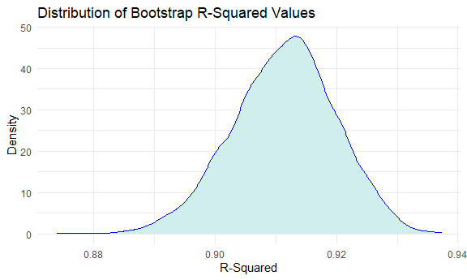
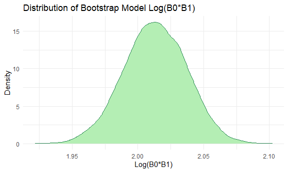

p8105\_hw6\_acm2268
================
Amanda Miles
12/4/2021

# Question 1: Birthweight

## Data Import

``` r
birthweight_df = read_csv(file = "./data/birthweight.csv") %>%
  janitor::clean_names() %>%
  view()
```

    ## Rows: 4342 Columns: 20

    ## -- Column specification --------------------------------------------------------
    ## Delimiter: ","
    ## dbl (20): babysex, bhead, blength, bwt, delwt, fincome, frace, gaweeks, malf...

    ## 
    ## i Use `spec()` to retrieve the full column specification for this data.
    ## i Specify the column types or set `show_col_types = FALSE` to quiet this message.

``` r
str(birthweight_df)
```

    ## spec_tbl_df [4,342 x 20] (S3: spec_tbl_df/tbl_df/tbl/data.frame)
    ##  $ babysex : num [1:4342] 2 1 2 1 2 1 2 2 1 1 ...
    ##  $ bhead   : num [1:4342] 34 34 36 34 34 33 33 33 36 33 ...
    ##  $ blength : num [1:4342] 51 48 50 52 52 52 46 49 52 50 ...
    ##  $ bwt     : num [1:4342] 3629 3062 3345 3062 3374 ...
    ##  $ delwt   : num [1:4342] 177 156 148 157 156 129 126 140 146 169 ...
    ##  $ fincome : num [1:4342] 35 65 85 55 5 55 96 5 85 75 ...
    ##  $ frace   : num [1:4342] 1 2 1 1 1 1 2 1 1 2 ...
    ##  $ gaweeks : num [1:4342] 39.9 25.9 39.9 40 41.6 ...
    ##  $ malform : num [1:4342] 0 0 0 0 0 0 0 0 0 0 ...
    ##  $ menarche: num [1:4342] 13 14 12 14 13 12 14 12 11 12 ...
    ##  $ mheight : num [1:4342] 63 65 64 64 66 66 72 62 61 64 ...
    ##  $ momage  : num [1:4342] 36 25 29 18 20 23 29 19 13 19 ...
    ##  $ mrace   : num [1:4342] 1 2 1 1 1 1 2 1 1 2 ...
    ##  $ parity  : num [1:4342] 3 0 0 0 0 0 0 0 0 0 ...
    ##  $ pnumlbw : num [1:4342] 0 0 0 0 0 0 0 0 0 0 ...
    ##  $ pnumsga : num [1:4342] 0 0 0 0 0 0 0 0 0 0 ...
    ##  $ ppbmi   : num [1:4342] 26.3 21.3 23.6 21.8 21 ...
    ##  $ ppwt    : num [1:4342] 148 128 137 127 130 115 105 119 105 145 ...
    ##  $ smoken  : num [1:4342] 0 0 1 10 1 0 0 0 0 4 ...
    ##  $ wtgain  : num [1:4342] 29 28 11 30 26 14 21 21 41 24 ...
    ##  - attr(*, "spec")=
    ##   .. cols(
    ##   ..   babysex = col_double(),
    ##   ..   bhead = col_double(),
    ##   ..   blength = col_double(),
    ##   ..   bwt = col_double(),
    ##   ..   delwt = col_double(),
    ##   ..   fincome = col_double(),
    ##   ..   frace = col_double(),
    ##   ..   gaweeks = col_double(),
    ##   ..   malform = col_double(),
    ##   ..   menarche = col_double(),
    ##   ..   mheight = col_double(),
    ##   ..   momage = col_double(),
    ##   ..   mrace = col_double(),
    ##   ..   parity = col_double(),
    ##   ..   pnumlbw = col_double(),
    ##   ..   pnumsga = col_double(),
    ##   ..   ppbmi = col_double(),
    ##   ..   ppwt = col_double(),
    ##   ..   smoken = col_double(),
    ##   ..   wtgain = col_double()
    ##   .. )
    ##  - attr(*, "problems")=<externalptr>

``` r
skimr::skim(birthweight_df)
```

|                                                  |                 |
|:-------------------------------------------------|:----------------|
| Name                                             | birthweight\_df |
| Number of rows                                   | 4342            |
| Number of columns                                | 20              |
| \_\_\_\_\_\_\_\_\_\_\_\_\_\_\_\_\_\_\_\_\_\_\_   |                 |
| Column type frequency:                           |                 |
| numeric                                          | 20              |
| \_\_\_\_\_\_\_\_\_\_\_\_\_\_\_\_\_\_\_\_\_\_\_\_ |                 |
| Group variables                                  | None            |

Data summary

**Variable type: numeric**

| skim\_variable | n\_missing | complete\_rate |    mean |     sd |     p0 |     p25 |     p50 |     p75 |   p100 | hist  |
|:---------------|-----------:|---------------:|--------:|-------:|-------:|--------:|--------:|--------:|-------:|:------|
| babysex        |          0 |              1 |    1.49 |   0.50 |   1.00 |    1.00 |    1.00 |    2.00 |    2.0 | ▇▁▁▁▇ |
| bhead          |          0 |              1 |   33.65 |   1.62 |  21.00 |   33.00 |   34.00 |   35.00 |   41.0 | ▁▁▆▇▁ |
| blength        |          0 |              1 |   49.75 |   2.72 |  20.00 |   48.00 |   50.00 |   51.00 |   63.0 | ▁▁▁▇▁ |
| bwt            |          0 |              1 | 3114.40 | 512.15 | 595.00 | 2807.00 | 3132.50 | 3459.00 | 4791.0 | ▁▁▇▇▁ |
| delwt          |          0 |              1 |  145.57 |  22.21 |  86.00 |  131.00 |  143.00 |  157.00 |  334.0 | ▅▇▁▁▁ |
| fincome        |          0 |              1 |   44.11 |  25.98 |   0.00 |   25.00 |   35.00 |   65.00 |   96.0 | ▃▇▅▂▃ |
| frace          |          0 |              1 |    1.66 |   0.85 |   1.00 |    1.00 |    2.00 |    2.00 |    8.0 | ▇▁▁▁▁ |
| gaweeks        |          0 |              1 |   39.43 |   3.15 |  17.70 |   38.30 |   39.90 |   41.10 |   51.3 | ▁▁▂▇▁ |
| malform        |          0 |              1 |    0.00 |   0.06 |   0.00 |    0.00 |    0.00 |    0.00 |    1.0 | ▇▁▁▁▁ |
| menarche       |          0 |              1 |   12.51 |   1.48 |   0.00 |   12.00 |   12.00 |   13.00 |   19.0 | ▁▁▂▇▁ |
| mheight        |          0 |              1 |   63.49 |   2.66 |  48.00 |   62.00 |   63.00 |   65.00 |   77.0 | ▁▁▇▂▁ |
| momage         |          0 |              1 |   20.30 |   3.88 |  12.00 |   18.00 |   20.00 |   22.00 |   44.0 | ▅▇▂▁▁ |
| mrace          |          0 |              1 |    1.63 |   0.77 |   1.00 |    1.00 |    2.00 |    2.00 |    4.0 | ▇▇▁▁▁ |
| parity         |          0 |              1 |    0.00 |   0.10 |   0.00 |    0.00 |    0.00 |    0.00 |    6.0 | ▇▁▁▁▁ |
| pnumlbw        |          0 |              1 |    0.00 |   0.00 |   0.00 |    0.00 |    0.00 |    0.00 |    0.0 | ▁▁▇▁▁ |
| pnumsga        |          0 |              1 |    0.00 |   0.00 |   0.00 |    0.00 |    0.00 |    0.00 |    0.0 | ▁▁▇▁▁ |
| ppbmi          |          0 |              1 |   21.57 |   3.18 |  13.07 |   19.53 |   21.03 |   22.91 |   46.1 | ▃▇▁▁▁ |
| ppwt           |          0 |              1 |  123.49 |  20.16 |  70.00 |  110.00 |  120.00 |  134.00 |  287.0 | ▅▇▁▁▁ |
| smoken         |          0 |              1 |    4.15 |   7.41 |   0.00 |    0.00 |    0.00 |    5.00 |   60.0 | ▇▁▁▁▁ |
| wtgain         |          0 |              1 |   22.08 |  10.94 | -46.00 |   15.00 |   22.00 |   28.00 |   89.0 | ▁▁▇▁▁ |

The dataset includes information on 4,342 children. It includes 20
variables and has 4,342 rows. All of the variables are numeric and there
are no missing values.

## Data Cleaning

``` r
birthweight_clean = birthweight_df %>%
  mutate(
    babysex = as.factor(as.character(babysex)),
    babysex = fct_recode(babysex, 
                     "female" = "2",
                     "male" = "1"),
    frace = as.factor(as.character(frace)),
    frace = fct_recode(frace,
                       "White" = "1",
                       "Black" = "2",
                       "Asian" = "3",
                       "Puerto Rican" = "4",
                       "Other" = "8",
                       "Unknown" = "9"),
    malform = as.factor(as.character(malform)),
    malform = fct_recode(malform,
                         "absent" = "0",
                         "present" = "1"),
    mrace = as.factor(as.character(mrace)),
    mrace = fct_recode(mrace,
                       "White" = "1",
                       "Black" = "2",
                       "Asian" = "3",
                       "Puerto Rican" = "4",
                       "Other" = "8")
    )
```

    ## Warning: Unknown levels in `f`: 9

    ## Warning: Unknown levels in `f`: 8

``` r
birthweight_clean %>%
  summarize(
    frace_unknown = sum(frace == "Unknown"),
    mrace_other = sum(mrace == "Other")
  )
```

    ## # A tibble: 1 x 2
    ##   frace_unknown mrace_other
    ##           <int>       <int>
    ## 1             0           0

Converted the appropriate variables to factors and investigated the
unknown levels in frace = “unknown” and mrace = “other”.

## Model 1: Regression Model for Birthweight

``` r
model_1 = lm(bwt ~ gaweeks + momage + smoken + fincome, data = birthweight_clean)

model_1 %>% 
  broom::tidy() %>%
  select(term, estimate, p.value) %>% 
  knitr::kable(digits = 3)
```

| term        | estimate | p.value |
|:------------|---------:|--------:|
| (Intercept) |  333.768 |       0 |
| gaweeks     |   64.588 |       0 |
| momage      |    8.758 |       0 |
| smoken      |   -7.103 |       0 |
| fincome     |    1.946 |       0 |

The predictor variables were chosen based on my hypothesized structure
for the factors that underlie birth weight. Premature birth can lead to
a lower birth weight, so I hypothesize that the number of gestation
weeks at birth is a factor that drives baby birth weight. Additionally,
mothers who are older when they give birth or are smokers can have lower
birth weight babies, so I hypothesize that mother’s age and mother’s
smoking status are two additional factors that underlie baby’s birth
weight. Additionally, I hypothesize that SES could be associated with
baby’s birth weight so I included family’s monthly income as the last
predictor in my model. My proposed linear regression model for birth
weight is as follows:

bwt = b0 + b1(gaweeks) + b2(momage) + b3(smoken) + b4(fincome)

## Residual Plot for Model 1

``` r
birthweight_res = birthweight_clean %>%
  add_residuals(model_1) %>%
  add_predictions(model_1) %>% 
  mutate(
    resid = round(resid, digits = 3),
    pred = round(pred, digits = 3)
  )

ggplot(birthweight_res, aes(x = pred, y = resid)) + 
  geom_point(size = .5, color = "blue") +
  labs(x = "Predicted Birthweight (grams)",
       y = "Residual",
       title = "Association between Residuals and Predicted Birthweight")
```



## Cross-Validation

### Created Models 2 and 3

``` r
model_2 = lm(bwt ~ blength + gaweeks, data = birthweight_clean)

model_3 = lm(bwt ~ 
               bhead + blength + babysex + 
               bhead * blength + bhead * babysex + blength * babysex +
               bhead * blength * babysex,
               data = birthweight_clean)
```

### Creating Crossv\_mc Tibble with Train & Test Data

``` r
cv_df = 
  crossv_mc(birthweight_clean, 100)

cv_df = cv_df %>%
  mutate(
    train = map(train, as_tibble),
    test = map(test, as_tibble)
  ) %>% view()
```

### Fit models and get RMSEs (Root Mean Squared Errors)

``` r
rmse_df =
  cv_df %>%
  mutate(
    model_1 = map(.x = train, 
                  ~lm(bwt ~ gaweeks + momage + smoken + fincome, 
                  data = .x)),
    model_2 = map(.x = train,
                  ~lm(bwt ~ blength + gaweeks, 
                      data = .x)),
    model_3 = map(.x = train,
                  ~lm(bwt ~ 
                      bhead + blength + babysex + 
                      bhead * blength + bhead * babysex +
                      blength * babysex +
                      bhead * blength * babysex,
                      data = .x))
  ) %>%
  mutate(
     rmse_model_1 = map2_dbl(model_1, 
                             test, 
                             ~rmse(model = .x, data = .y)),
    rmse_model_2 = map2_dbl(model_2,
                            test, 
                            ~rmse(model = .x, data = .y)),
    rmse_model_3 = map2_dbl(model_3,
                            test, 
                            ~rmse(model = .x, data = .y))
  )
```

### Model Choice

``` r
rmse_clean = rmse_df %>%
  select(starts_with("rmse")) %>%
  pivot_longer(
    everything(),
    names_to = "model",
    values_to = "rmse",
    names_prefix = "rmse_"
  ) 

ggplot(rmse_clean, aes(x = model, y = rmse, color = model)) +
  geom_violin() +
  theme(legend.position = "right") +
  labs(x = "Regression Model",
       y = "RMSE",
       title = "RMSEs by Birthweight Regression Model")
```



``` r
rmse_clean %>%
  group_by(model) %>%
  summarize(avg_rmse = mean(rmse))
```

    ## # A tibble: 3 x 2
    ##   model   avg_rmse
    ##   <chr>      <dbl>
    ## 1 model_1     461.
    ## 2 model_2     332.
    ## 3 model_3     289.

Based on the average RMSE for each of the models, Model 1 has the
highest average RMSE, Model 2 has the second highest average RMSE, and
Model 3 has the lowest average RMSE. From the Violin plot, we can see
that Model 1 consistently has the highest RMSE when fitted to the test
data sets. While there is some overlap in the RMSEs for Model 2 and
Model 3, Model 2 generally has a higher RMSE than Model 3.

RMSE gives us a sense of the average distance between the birth weight
that is observed and the birth weight values predicted by each of the
regression models. Since Model 3 has the lowest average RMSE, Model 3 is
generally the best of the three models for predicting baby’s birth
weight.

In other words, a model which includes the main effects and interactions
between the baby’s head circumference at birth, the baby’s length in
centimeters at birth, and the baby’s sex more accurately predicts baby’s
birth weight when compared to a model that includes the main effects of
the baby’s gestational age in weeks, the mother’s age at birth, the
mother’s smoking status, and the family’s financial income or a model
that includes the main effects of the baby’s length at birth and the
baby’s gestational age in weeks.

# Question 2: Central Park Weather in 2017

## Data Import

``` r
weather_df = 
  rnoaa::meteo_pull_monitors(
    c("USW00094728"),
    var = c("PRCP", "TMIN", "TMAX"), 
    date_min = "2017-01-01",
    date_max = "2017-12-31") %>%
  mutate(
    name = recode(id, USW00094728 = "CentralPark_NY"),
    tmin = tmin / 10,
    tmax = tmax / 10) %>%
  select(name, id, everything())
```

    ## Registered S3 method overwritten by 'hoardr':
    ##   method           from
    ##   print.cache_info httr

    ## using cached file: C:\Users\Amanda Miles\AppData\Local/Cache/R/noaa_ghcnd/USW00094728.dly

    ## date created (size, mb): 2021-12-04 17:05:16 (7.631)

    ## file min/max dates: 1869-01-01 / 2021-12-31

``` r
view(weather_df)

set.seed(1)
```

## Sample 5,000 Bootstraps and Run Model on Each

``` r
 weather_boots = weather_df %>% 
  bootstrap(n = 5000) %>%
  mutate(
    models = map(strap, ~lm(tmax ~ tmin, data = .x)),
    results = map(models, broom::tidy),
    glance = map(models, broom::glance)
  )

log_boots = 
  weather_boots %>%
  select(.id, strap, results) %>%
  unnest(results) %>%
  select(.id, strap, term, estimate, std.error)

r_2_boots = 
  weather_boots %>%
  select(.id, strap, glance) %>%
  unnest(glance) %>%
  select(.id, strap, r.squared)
```

## Calculating Log(B0\*B1)

``` r
log_boots_2 = 
  log_boots %>%
  mutate(
    log_estimate = log(estimate)
  ) %>%
  group_by(.id) %>%
  summarize(
    log_slope_int = sum(log_estimate)
    ) 

view(log_boots_2)
```

## Distribution Plots

``` r
ggplot(r_2_boots, aes(x = r.squared)) + geom_density(color = "blue", fill = "lightcyan2") +
labs(x = "R-Squared",
     y = "Density",
     title = "Distribution of Bootstrap R-Squared Values")
```



``` r
ggplot(log_boots_2, aes(x = log_slope_int)) + geom_density(color = "seagreen4", fill = "darkseagreen2") +
labs(x = "Log(B0*B1)",
     y = "Density",
     title = "Distribution of Bootstrap Model Log(B0*B1)")
```


The plot of the 5,000 bootstrap model R-squared values is approximately
normally distributed. The values range from approximately 0.87 to
approximately 0.937, with the mean being approximately 0.91.

The plot of the 5,000 bootstrap model log(b0\*b1) values is
approximately normally distributed. The values range from approximately
1.92 to approximately 2.10, with the mean being approximately 2.01.

## Confidence Intervals

``` r
r_2_boots %>%
  summarize(
    lower_cl = quantile(r.squared, 0.025),
    upper_cl = quantile(r.squared, 0.975)
  )
```

    ## # A tibble: 1 x 2
    ##   lower_cl upper_cl
    ##      <dbl>    <dbl>
    ## 1    0.894    0.927

``` r
log_boots_2 %>%
  summarize(
    lower_cl = quantile(log_slope_int, 0.025),
    upper_cl = quantile(log_slope_int, 0.975)
   )
```

    ## # A tibble: 1 x 2
    ##   lower_cl upper_cl
    ##      <dbl>    <dbl>
    ## 1     1.96     2.06

The 95% confidence interval for the model R-squared ranges from 0.8937
to 0.9271.

The 95% confidence interval for the model log(b0\*b1) ranges from 1.9649
to 2.0589.
